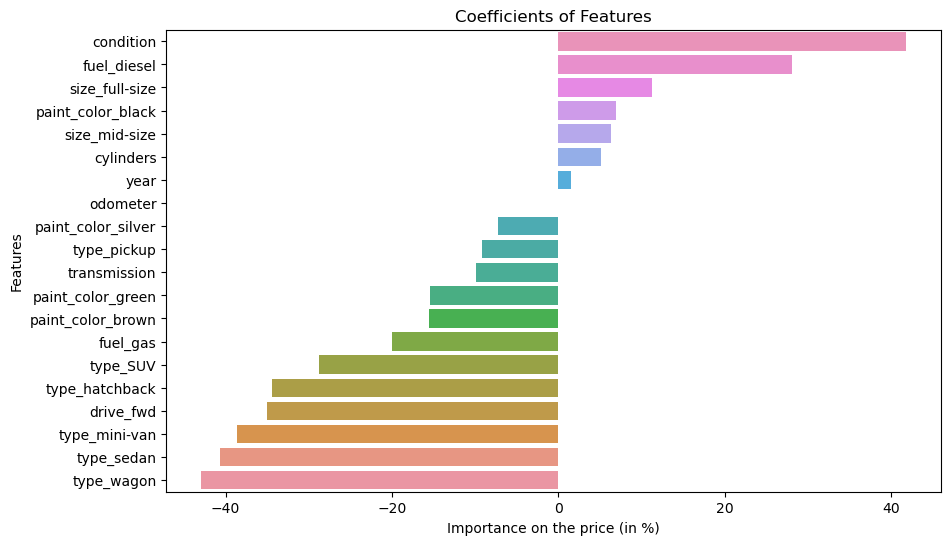

# Project Name

Practical application: What drives the price of a car?

## Context

In this application, we are exploring a dataset from kaggle. The original dataset contained information on 3 million used cars. The provided dataset contains information on 426K cars to ensure speed of processing.  Your goal is to understand what factors make a car more or less expensive.  

## Data

### Data Description
Keep in mind that these values mentioned below are average values.

The attributes of this data set include:
    - id (unused)
    - region
    - price
    - year 
    - manufacturer
    - model
    - condition (new,like new,excellent,good,fair,salvage)
    - cylinders
    - fuel (diesel, gas, hybrid, ...)
    - odometer
    - title_status
    - transmission (automatic, manual)
    - VIN
    - drive (4wd, fwd, rwd)
    - size (full, compact, ...)
    - type
    - paint_color
    - state 

## Summary of Findings

After using differents modelizations on the dataset, we get these key insights on pricing a used car :

From far the main characteristic is the condition of the car.
At the opposite of what we could have expected the mileage is not significatively impacting.

The price is increasing for :
- diesel cars, 
- full-size and mid_size cars, 
- black cars, 
- powerful cars (cylinders), 
- recent cars.

The price is decreasing for :
- wagon,sedan,mini-van, hatchback,SUV and less for pickup type cars,
- green or brown cars and less for silver,
- fwd drive cars,
- gas cars.

As you can see below:

When pricing a used car, pay attention to the condition of the car, a difference between a car in fair condition and the same car in good condition would be a difference in the price of 42 points.

Prefer the full (11% more expensive) and mid-size cars(6% more expensive) rather than the compact and sub-compact cars.

When it comes to the color, the black ones will sell at a higher price (7% more expensive), while the brown and green will sell at a lower price than the exact same car on a different color (15% cheaper).

Diesel cars are 28% more expensive than the one which are not and gas cars are 20% less expensive.

About the power of the car, a car with 2 cylinders more than others would get 10% increase in its price.

## Next steps and recommendations
To get a specific price for a car, it's possible to make others analysis focused on a specific type of car of instance and get all the weights for all others factors (coefficients).

## Notebooks

- [Jupyter Notebook](./prompt_II.ipynb): A detailed exploration and analysis of the data.
